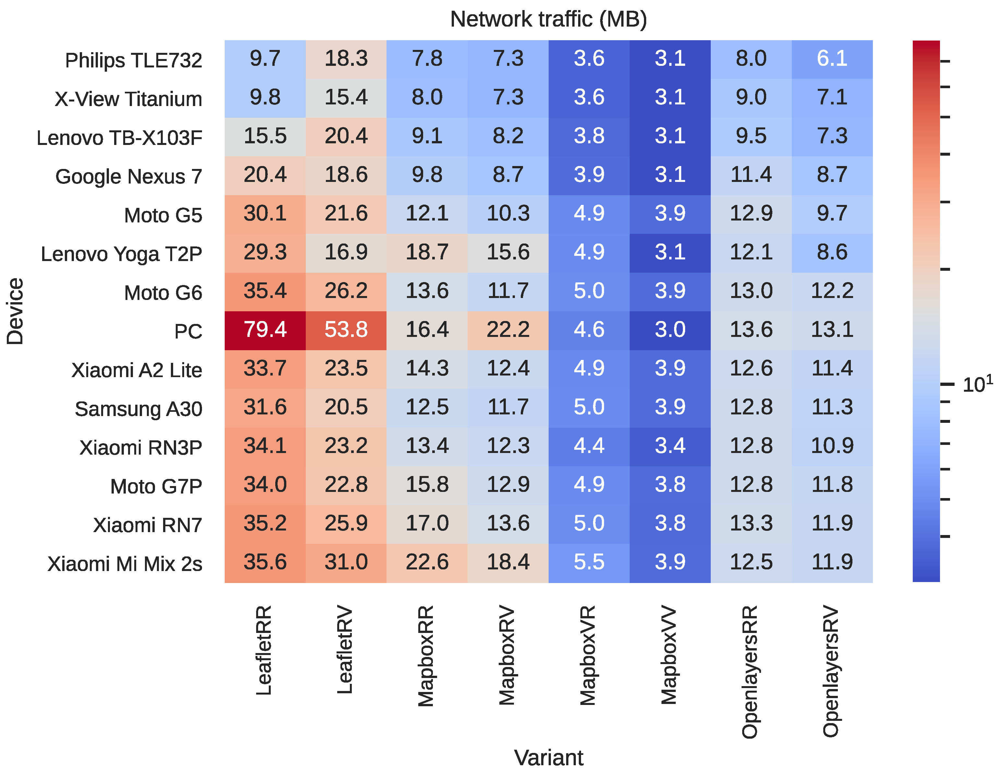
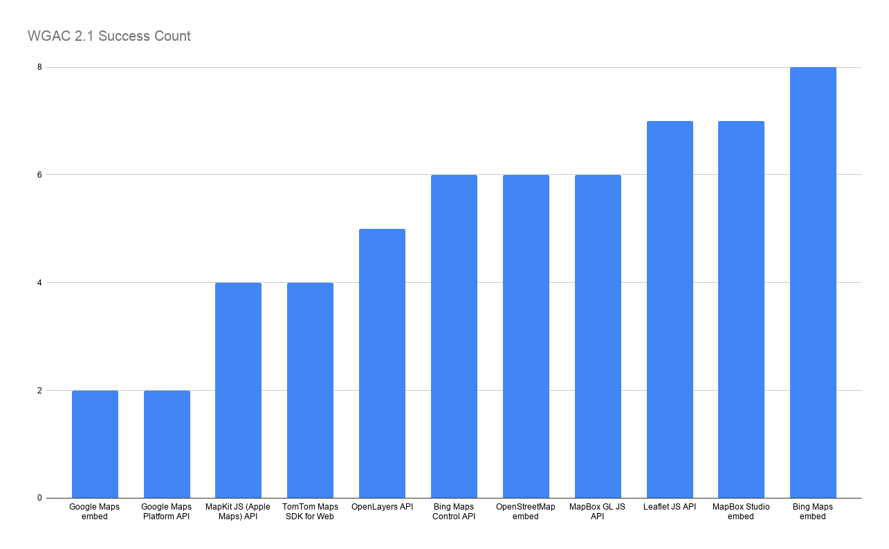
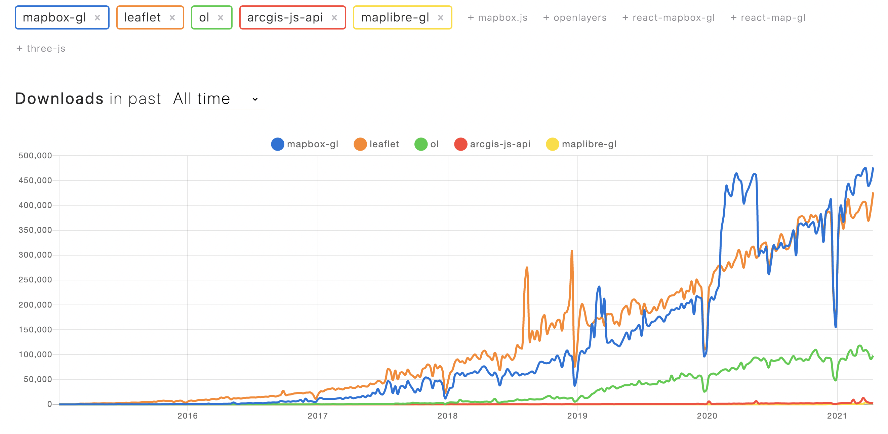

# [short title of solved problem and solution]

- Status: draft
- Deciders: Lucas Brown, Shelby Switzer, Nat Hillard
- Date: 2021-04-21
- Tags: frontend

Technical Story: [#7](https://github.com/usds/environmental-justice/issues/7)

## Context and Problem Statement

In order to visualize the metrics of the Justice 40 initiative, we need a client-side mapping solution. This solution should should reflect the values of our initiative, and it should reflect and respond to the diverse needs of our users.

**Team Values**: The solution should be open-source, modular, and adopt modern best practices.

**User needs**: The solution should be performant, accessible, internationalized/localized, and minimize data usage.

We provide more detail on these factors below.

## Decision Drivers

### Team Values

- **Open source** : Our technology choices should "default to open" as detailed in the [Digital Services Playbook](https://playbook.cio.gov/#play13), in order to encourage community contribution, minimize vendor lock-in, and lower the barrier to entry to participate in the development of the tool. Ideally such a solution should be be true [Free and Open Source Software](https://en.wikipedia.org/wiki/Free_and_open-source_software), licensed for use, copy, and modification as well as source code-visible.
- **Modular** : we should minimize vendor lock-in and allow for mixing and matching solutions from different providers -- from server-vended tiling solutions to tile storage and basemaps -- in order to optimize user experience and find the best tool for the job at all layers of the stack.
- **Modern** : the library should allow for its work to be done entirely in the browser; it should provide the ability to load on demand (in binary, protobuf [format](https://github.com/mapbox/vector-tile-spec)) and visualize so-called [vector tiles](https://en.wikipedia.org/wiki/Vector_tiles) to make use of the rendering power of [WebGL](https://www.khronos.org/webgl/); and it should provide for client-side dynamic xmap styling according to relevant [standards](https://docs.mapbox.com/mapbox-gl-js/style-spec/) as opposed to just server-side pre-rendering.

### User Needs

- **Performant** : Library should be performant on a range of device types, enabling fast load times and ease of navigation in a highly-complex rendering environment where there may be hundreds of thousands of features.
- **Accessible** : library must be compliant according to [section 508](https://www.section508.gov/) of the Rehabilitation Act [(29 U.S.C. § 794d)](https://www.govinfo.gov/content/pkg/USCODE-2011-title29/html/USCODE-2011-title29-chap16-subchapV-sec794d.htm), as well as [Section 501](https://www.eeoc.gov/statutes/rehabilitation-act-1973) guidance regarding Reasonable Accommodation per US federal government legal requirements. Ideally it should adopt [Web Content Accessibility Guidelines](https://www.w3.org/WAI/standards-guidelines/wcag/) to at least the AA level.
- **Internationalized/Localized** : Nearly [22%](https://data.census.gov/cedsci/table?q=B16001&hidePreview=false&tid=ACSDT1Y2017.B16001&vintage=2018) of the US population speaks a language other than English at home. Our mapping solution should be familiar and easy to use by this population.
- **Secure** :
- **Mobile-Friendly** :
- **Minimizes network usage** : Where possible, we should seek to minimize network usage to ensure lower data usage costs and faster load times.

## Considered Options

1. [Mapbox GL JS](https://github.com/mapbox/mapbox-gl-js) - v2.2.0 (3/25/21)
2. [MapLibre GL JS](https://github.com/maplibre/maplibre-gl-js) - v1.14.0 (3/24/21)
3. [Leaflet](https://github.com/Leaflet/Leaflet) - v1.7.1 (9/4/20) + [Leaflet.VectorGrid](https://github.com/Leaflet/Leaflet.VectorGrid) - v1.3.0 (2017)
4. [OpenLayers](https://github.com/openlayers/openlayers) - v6.5.0 (12/27/20)
5. [ArcGIS API for Javascript](https://developers.arcgis.com/javascript/latest/) - v4.18 (12/2020)

## Decision Outcome

Chosen option: **Mapbox GL JS**. This library has wide adoption, is modular, and allows for integration with a modern web mapping stack. Additionally, it combines best-in-class performance, accessibility, internationalization, and the ability to consume vector tiles and render them with WebGL. Though as of v2.0.0 it now has a proprietary license, the alternative, Maplibre, is quite young still and is still [discussing](https://github.com/maplibre/maplibre-gl-js/pull/21) the implications of backward compatibility. Perhaps in the future we can consider using this or a similar open fork.

### Positive Consequences

- **Performance** : The below chart comes from an September 2020 [study](https://doi.org/10.3390/ijgi9100563). The purpose of this study was to compare Mapbox-GL-JS to OpenLayers and Leaflet (both raster and vector tile variants) as the potential basis for a Life Quality Index for 55,000+ census radius jurisdictions in Argentina. Though tested on library versions as of September 2020, (in particular, Mapbox-GL-JS 1.12.0), performance seemed similar according to local testing.
   ([Source](https://doi.org/10.3390/ijgi9100563))
  In this chart, the two letters following the library name are for basemap layer and feature layer. Further, "R" is "raster" and "V" is vector, and lower numbers indicate faster load times. "MapboxRV", signifying a raster base layer and vector feature layer, performed the best overall for all device classes.
- **Data Usage**: The same study above also analyzed the amount of data usage for each of the libraries under investigation, and the result was the below chart (Lower values are better).
   ([Source](https://doi.org/10.3390/ijgi9100563))
  In this chart as well, MapboxRV and MapboxVV perform the best of the available options.
- **Modern stack**: Mapbox supports WebGL rendering, vector tiles, and standardized tile styling
- **Modularity**: Mapbox interoperates with various basemap providers, and thanks to the open-sourcing of both its [vector tile format](https://docs.mapbox.com/vector-tiles/specification/) and its [styling language](https://docs.mapbox.com/mapbox-gl-js/style-spec/), there are a [number](https://github.com/mapbox/awesome-vector-tiles) of tools, libraries, and frameworks that easily interoperate with this solution.]
- **(Relative) Accessibility** : According to a recent exhaustive WCAG 2.1 [evaluation](https://github.com/Malvoz/web-maps-wcag-evaluation/) that compared several map providers, though almost all web maps performed [poorly](https://wcag-maps.nicchan.me/), Mapbox-GL-JS came out 4th out of 12. Mapbox also released several [patches](https://github.com/mapbox/mapbox-gl-js/pulls?q=is%3Apr++accessibility+) recently to address the issues that were found and are actively working on this.
   (Source: original, based on data [here](https://github.com/Malvoz/web-maps-wcag-evaluation/))
  This chart counts the number of successful WCAG 2.1 criteria from the above-linked study.
- **Localization** : Through the mapbox-gl-language [plugin](https://github.com/mapbox/mapbox-gl-language/), it is possible to dynamically change the language of mapbox-provided basemaps to other languages. Additionally, they have a plugin for displaying [RTL languages](https://github.com/mapbox/mapbox-gl-rtl-text), and the [ability](https://docs.mapbox.com/mapbox-gl-js/style-spec/expressions/#types-number-format) to format numbers according to locale conventions.
- **Popularity** : According to [NPM Trends](https://www.npmtrends.com/mapbox-gl-vs-leaflet-vs-ol-vs-arcgis-js-api-vs-maplibre-gl) Mapbox-GL is the most downloaded package among those considered. More info [here](https://www.geoapify.com/map-libraries-comparison-leaflet-vs-mapbox-gl-vs-openlayers-trends-and-statistics)
  

### Negative Consequences

- **Licensing** : Mapbox's December 2020 [announcement](https://github.com/mapbox/mapbox-gl-js/releases/tag/v2.0.0) of version 2.0 of their software changed ther license to proprietary and changed their pricing scheme to cover tiles loaded from outside of their service. This decision was met with [some criticism](https://joemorrison.medium.com/death-of-an-open-source-business-model-62bc227a7e9b) in the open-source mapping community.
  - Mitigation: We can look into MapLibre or discuss other alternatives if there is community response
- **508 Compliance** : Accessibility for web mapping technology in general is [not](https://wcag-maps.nicchan.me/) [good](https://sparkgeo.com/blog/the-accessibility-of-web-maps/). As of now, the default 2D visualizations in and of themselves do not provide explicit 508 compliance, and there is no official accessibilty [statement](https://www.w3.org/WAI/planning/statements/) for Mapbox-GL-JS
  - Mitigations:
    - The Mapbox-gl-accessibility [plugin](https://github.com/mapbox/mapbox-gl-accessibility) provides additional accessibility controls
    - According to at least one accessibility [expert](http://stackoverflow.com/questions/15659051/google-maps-508-accessibility-without-styles/16060809#16060809), it is sufficient for compliance reasons to provide an alternative means of viewing the same information provided by the map, perhaps in a table or other format. This is a common solution to this problem.
    - Though the library itself does not provide an accessibility guarantee, many of the 508 and WCAG standards are a matter of how you _use_ a particular library - e.g. ensuring proper color contrast, providing alternative markers not based on coloration, and providing text highlighting. We can guarantee that these are in place and ensure an accessibility audit of our featureset before release alongside user testing with low-vision and visually-impaired users directly.
- **Library Size** : Mapbox-GL is one of the larger libraries considered as far as filesize, coming in at 214.1 KB ([Source](https://www.npmtrends.com/mapbox-gl-vs-leaflet-vs-ol-vs-arcgis-js-api-vs-maplibre-gl))
- **Pricing** : As of version 2.0.0, Mapbox [charges](https://www.mapbox.com/pricing/#maploads) per "map load", defined as "every time Mapbox GL JS initializes on a webpage or in a web app". Up to 50,000 loads per month are free, and beyond this pricing varies. Users are likely to do a number of loads per sitting, however, so this is something we will need to consider, even in a relatively low-traffic tool.

## Pros and Cons of the Options

### MapLibre-GL-JS

[Source](https://github.com/maplibre/maplibre-gl-js) - v1.14.0 (3/24/21)
MapLibre is a fork of Mapbox 1.13.0 that preserves the older BSD 3-clause license.

#### MapLibre-GL-JS Pros

- **Everything above** : Being a fork of Mapbox GL JS (though an earlier version), MapLibre has all of the benefits of Mapbox called out above
- **Licensing** : Returns to 3-Clause BSD [License](https://github.com/maplibre/maplibre-gl-js/blob/main/LICENSE.txt) means true FOSS licensing, as well as free operation

#### MapLibre-GL-JS Cons

- **Maturity** : This library is still quite young, having been formed only mid-December last year
- **Licensing Complications** : There may be licensing or legal challenges from Mapbox around the use of this tool
- **Component-based Wrappers** : Though supported by [react-map-gl](https://github.com/visgl/react-map-gl), there is not yet as full-featured support for MapLibre-GL in other component-based wrapper libraries
- **Backwards Compatibility** : There is an [issue](https://github.com/maplibre/maplibre-gl-js/pull/21) open now discussing the possibility of breaking backwards compatibility as part of a MapLibre 2.0 release. In practice this would mean we would not be able to use layers created within Mapbox in MapLibre tooling.
- **New Features** : There is not yet clarity on how and when this library would be updated and what its upcoming feature roadmap looks like

### Leaflet

[Source](https://github.com/Leaflet/Leaflet) - v1.7.1 (9/4/20) + [Leaflet.VectorGrid](https://github.com/Leaflet/Leaflet.VectorGrid) - v1.3.0 (2017)
Leaflet is a popular open-source mapping visualization library that has been around since 2010.

#### Leaflet Pros

- **Popularity** : Leaflet has by far the largest number of [stars](https://github.com/Leaflet/Leaflet/stargazers) on Gitbub (30,500 at the time of writing)
- **Modularity** : Leaflet has a [number](https://leafletjs.com/plugins.html) of plugins that augment its functionality, including [Leaflet.VectorGrid](https://github.com/Leaflet/Leaflet.VectorGrid) which enables Vector Tiles
- **License** : Leaflet is BSD 2-Clause [licensed](https://github.com/Leaflet/Leaflet/blob/master/LICENSE)

#### Leaflet Cons

- **Performance** : As seen above, Leaflet performance is quite poor across device types, relative to other libraries, even with the vector plugin
- **Modern Stack** : The lack of out-of-the-box vector tile support opens the possibility for version requirement mismatches. Additionally, the last update to the VectorGrid plugin was a [year ago](https://github.com/Leaflet/Leaflet.VectorGrid/commits/master)

### OpenLayers

[Source](https://github.com/openlayers/openlayers) - v6.5.0 (12/27/20)

#### OpenLayers Pros

- **Licensing** : OpenLayers is BSD 2-Clause [licensed](https://github.com/openlayers/openlayers/blob/main/LICENSE.md)
- **Performant** : According to above chart, OpenLayers is generally performant across device types, in some instances equivalent to Mapbox
- **More fully featured** : OpenLayers has a number of GIS features that other tools do not

#### OpenLayers Cons

- **Longer learning curve**

### ArcGIS API for Javascript

[Source](https://developers.arcgis.com/javascript/latest/) - v4.18 (12/2020)

#### ArcGIS API for Javascript Pros

- **508 Compliance** : ArcGIS provides regularly-updated accessibility [conformance reports](https://www.esri.com/en-us/legal/accessibility/conformance-reports) detailing their products' conformance with 508 standards.
- **Wide Usage/Maturity** : ArcGIS is a widely-used tool in this space

#### ArcGIS API for Javascript Cons

## References

- [State of Minnesota Accessibility Guide for Interactive Web Maps](https://mn.gov/mnit/assets/web-map-accessibility-guide_tcm38-403564.pdf)
